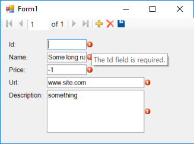
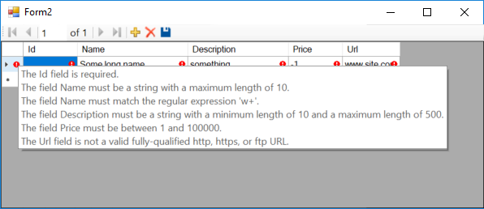

# DataAnnotations Validation Attributes in Windows Forms

This example shows how to use DataAnnotations Validation Attributes in Windows Forms.

Data Annotation Validation attributes enable you to perform model validation simply decorating class properties with validation attributes such as the `Required`, `StringLength`, `RegularExpression`, `Range`, `Url`, etc. 

To bring validation attributes support to our model classes, we need to implement `IDataErrorInfo`. There is a [`Validator`](https://msdn.microsoft.com/en-us/library/system.componentmodel.dataannotations.validator%28v=vs.110%29.aspx?f=255&MSPPError=-2147217396) class in `System.ComponentModel.DataAnnotations.dll` which has a couple of methods which allows us to validate an object or a property of an object using validation attributes.

After implemting `IDataErrorInfo` if create a sample model and decorate its properties with validation attributes:

    public class SampleModel : BaseModel
    {
        [Required]
        [Range(1, 100)]
        public int? Id { get; set; }

        [Required]
        [StringLength(10)]
        [RegularExpression("w+")]
        public string Name { get; set; }

        [Required]
        [StringLength(500, MinimumLength = 10)]
        public string Description { get; set; }

        [Required]
        [Range(1, 100000)]
        public int Price { get; set; }

        [Required]
        [Url]
        public string Url { get; set; }
    }

Then if you setup data binding using to `SampleModel` using a `BindingSource` and use an `ErrorProvider`, then you can see error icon near the controls and if you hover on the error icon, you can see error message in tooltip:

Also if you use a `DataGridView`, errors will be shown on cells and rows:

